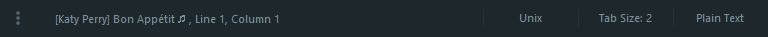

# [Sublimify](https://atom.io/packages/atomify) (Where Sublime Meets Spotify)
View and Control your Spotify experience without leaving Sublime Text

### Status Bar Info

### Commands / Shortcuts

|       Command       |                      Shortcut                     |
|---------------------|:-------------------------------------------------:|
| Play/Pause          |  <kbd>Ctrl</kbd> + <kbd>Alt</kbd> + <kbd>P</kbd>  |  
| Next Track          |  <kbd>Ctrl</kbd> + <kbd>Alt</kbd> + <kbd>L</kbd>  |
| Previous Track      |  <kbd>Ctrl</kbd> + <kbd>Alt</kbd> + <kbd>J</kbd>  |
| Toggle Shuffle      |  <kbd>Ctrl</kbd> + <kbd>Alt</kbd> + <kbd>S</kbd>  |
| Select Repeat Mode  |  <kbd>Ctrl</kbd> + <kbd>Alt</kbd> + <kbd>R</kbd>  |
| Browse Library      |  <kbd>Ctrl</kbd> + <kbd>Alt</kbd> + <kbd>B</kbd>  |
| Refresh Library     |  -                                                | 

### Settings

|         Key        |                   Description                   |
|--------------------|-------------------------------------------------|
| `sublimify_status` | set to **false** to disable status bar info     |  

### Inspired by
**[Atomify](https://github.com/jaebradley/atomify/)** of [Jae Bradley](https://github.com/jaebradley)
